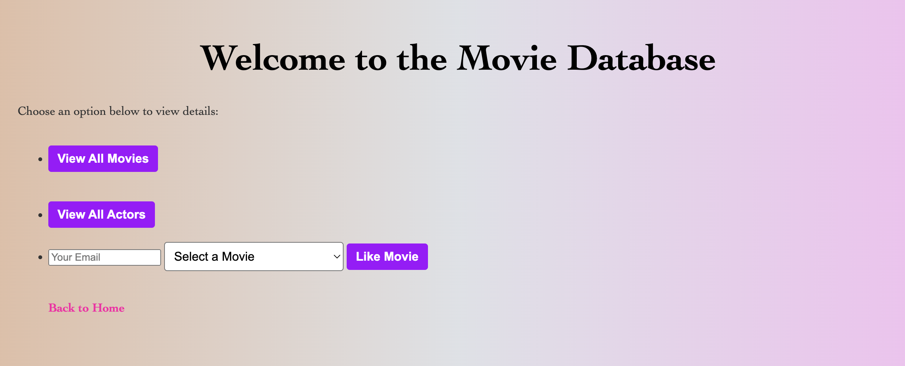
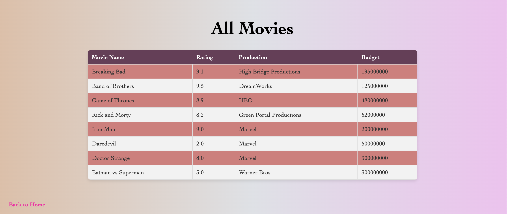
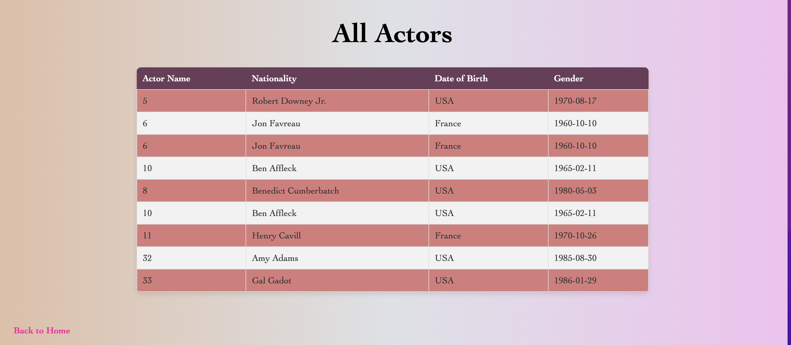

# Create Your Own IMDb
Team Members: 
1. Samiya Islam
2. Erica Egleston





## Overview
This project is a simple web application similar to IMDb that interacts with a MySQL/MariaDB database. The application features a Flask-based UI that allows users to **view movie and actor details, like movies, and execute SQL queries**.

The project is structured to **learn SQL** by implementing queries and database interactions manually.

> **IMPORTANT**: Object Relational Model (ORM) based queries are **not allowed** for any task. **All queries must be written using raw SQL statements without any Python-based processing.**

---

## **1. Pre-Requisites**
- **Python (3.10 or later)**
- **MariaDB**
- **Flask** (for the web framework)
- **PyMySQL** (for database connectivity)
- **All dependencies from `requirements.txt`**

---

## **2. Project Setup Instructions**

### **Step 1: Install and Configure MariaDB**
1. **Installation**  
   > **NOTE**: If you have already set up MariaDB for Written Assignment 2, you may skip the first two sections (*Installation* and *Starting the MariaDB Server*).

   Choose the appropriate installation method for your operating system:
    - **MacOS (Homebrew)**  
      ```bash
      brew install mariadb
      ```
    - **Ubuntu/Debian**  
      ```bash
      sudo apt install mariadb-server
      ```
    - **Windows**  
      Download and install from [MariaDB Official Website](https://mariadb.org/).

2. **Start MariaDB Server**
   ```bash
   # MacOS
   brew services start mariadb
   
   # Linux
   sudo systemctl start mariadb
   ```

   *(For Windows, the service starts automatically after installation.)*

3. **Create a new database and user for the project**
   Open a terminal and start MariaDB:
   ```bash
   mysql -u root -p
   ```

   Inside MySQL, run the following:
   > **NOTE**: Below commands must be run in your MySQL shell inside terminal.
   ```sql
   CREATE DATABASE moviedb;

   CREATE USER 'imdb'@'localhost' IDENTIFIED BY 'cosi-127b';

   GRANT ALL PRIVILEGES ON moviedb.* TO 'imdb'@'localhost';

   FLUSH PRIVILEGES;
   ```

---

### **Step 2: Clone or Download the Project**
- Clone the repository using:
  ```bash
  git clone https://github.com/SSD-Brandeis/IMDbDatabase
  ```
- Or download it manually from [GitHub](https://github.com/SSD-Brandeis/IMDbDatabase) by clicking the green "Code" button → **Download ZIP**.

---

### **Step 3: Configure Database Connection**
Open the project in your preferred code editor and update the `ini.env` file:

```ini
DB_USER=imdb
DB_PASSWORD=cosi-127b
DB_HOST=localhost
DB_DATABASE=moviedb
```

*(Replace `cosi-127b` with the password, if you used different while setting up MariaDB in Step 1.3 for `imdb` user)*

---

### **Step 4: Create Required Database Tables**
Use the SQL scripts provided to set up the database.

1. Open a terminal and start MySQL:
   ```bash
   mysql -u imdb -p moviedb
   ```
   > **NOTE**: Starting next step, all commands must be run in your MySQL shell inside terminal.
2. Create required tables as per the provided schema and ER-diagram in project document. Pay attention for required constraints (`CHECK`, `PRIMARY KEY`, `FOREIGN KEY` with `ON DELETE CASCADE`) while creating tables. Don't forget to run the below command before you start creating tables.
   ```sql
   USE moviedb; --- This takes you inside moviedb
   ```
3. Verify that the tables are created successfully:
   ```sql
   SHOW TABLES;
   ```
4. Execute the `data.sql` commands to insert initial data once tables are created.
5. Verify that your tables have some data into them:
   ```sql
   SELECT * FROM MotionPicture;
   ```

---

### **Step 5: Running the Flask Application**
Once your database is set up and populated with sample data, follow these steps to start the Flask application:
> **NOTE**: The following commands must be run in your command prompt (terminal), NOT inside the MySQL shell.
1. Install required dependencies:
   ```bash
   pip install -r requirements.txt
   ```
2. Run the Flask app:
   ```bash
   python run.py
   ```
3. Open a browser and visit:
   ```
   http://127.0.0.1:5000/
   ```

---

## **3. Implementing SQL Queries**
The project requires students to **write raw SQL queries** for two functionalities.

### **Task 1: Understanding Database Interactions**
- Familiarize yourself with `database.py`, which handles all database queries.
- See how `execute()` is used to interact with the database.

### **Task 2: Fetching and Displaying Actors**
Modify the function inside `actors.py` to fetch all actors' details from the database.
- Replace `query = """ """` with an SQL query to **fetch `name`, `nationality`, `dob`, and `gender` from `People`**.

### **Task 3: Implementing Movie Likes Feature**
Modify the function inside `movies.py` to allow users to like a movie.
- Replace `query = """ """` with an SQL query to insert a like.
- Use the `Database.execute()` function correctly with parameters.

---

## **4. Troubleshooting & Resetting Database**
If you encounter issues, use the following commands:

- **Truncate table data** (removes all rows but keeps table structure):
  ```sql
  TRUNCATE TABLE <table_name>;
  ```
- **Drop table and recreate**:
  ```sql
  DROP TABLE <table_name>;
  ```
- **Fix foreign key constraint errors when truncating/deleting**:
  ```sql
  SET FOREIGN_KEY_CHECKS=0;
  TRUNCATE TABLE <table_name>;
  SET FOREIGN_KEY_CHECKS=1;
  ```

---

## **5. Submission Guidelines**
1. **Complete the missing SQL queries** in `actors.py` and `movies.py`.
2. **Ensure your application runs without errors** and the database is correctly set up.

To verify:
- Run `python run.py` and check if **movies and actors display correctly**.
- Test if users can **like a movie**.

---

## **Final Notes**
- Do **not** modify `database.py` logic.
- Ensure your `.sql` queries execute correctly before implementing them in Flask.
- **Queries in `queries.py` will be used for future assignments. Do not modify this file now.**
